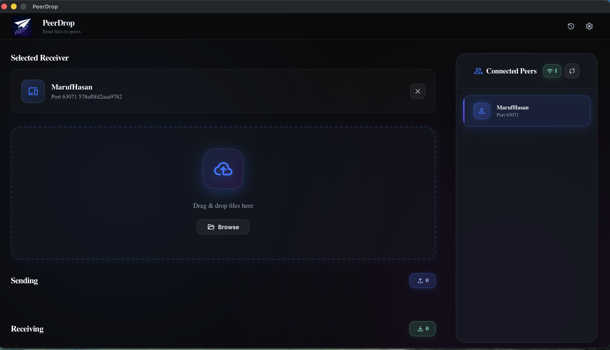
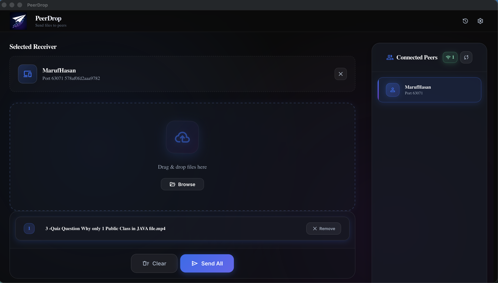
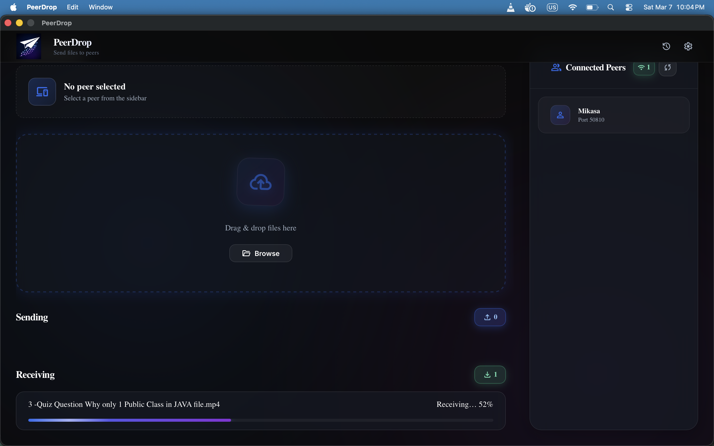

# PeerDrop

[](LICENSE)
[](https://golang.org)
[](https://wails.io)
[](https://github.com/Maruf-Hasan1789/peerdrop/releases)

**PeerDrop** is a fast, peer-to-peer file transfer tool for local networks.
No cloud. No servers. Just direct LAN transfers using **mDNS** for peer discovery.

---

## 📸 Screenshots

Here’s a quick look at PeerDrop in action:

<!-- Show only two thumbnails -->
[](./assets/screenshots/1.png)
[](./assets/screenshots/2.png)
[](./assets/screenshots/7.png)

<!-- Optional: hidden links for the rest -->
[Screenshot 3](./assets/screenshots/3.png)  
[Screenshot 4](./assets/screenshots/4.png)  
[Screenshot 5](./assets/screenshots/5.png)  
[Screenshot 6](./assets/screenshots/6.png)  
[Screenshot 8](./assets/screenshots/8.png)  
[Screenshot 9](./assets/screenshots/9.png)

## 🚀 Why PeerDrop?

* Transfer files directly over LAN
* Avoid USB drives and cloud uploads
* Share builds, logs, and test artifacts instantly

Designed for **everyone** who needs fast, easy LAN file transfers.

---

## ✨ Features

* ⚡ Fast file transfer over local network (No Http)
* 🌐 Automatic peer discovery using **mDNS**
* 📁 Multiple file selection
* 🖥 Cross-platform support (Windows, Linux)
* 🧩 Minimal and intuitive UI

> **Note:** Encryption is **not yet implemented**. Transfers occur only over the local network. Avoid untrusted networks.

---

## 📥 Releases

Download the latest pre-built releases here:
👉 [PeerDrop Releases](https://github.com/Maruf-Hasan1789/peerdrop/releases)

---

## 🛠 Tech Stack

| Component                         | Technology                                      |
|-----------------------------------|-------------------------------------------------|
| **Backend Language**              | Go                                              |
| **Desktop / UI Framework**        | Wails v2 (Vanilla JS + CSS)                     |
| **Networking Protocol**           | TCP                                             |
| **Metadata Serialization**        | Protocol Buffers (used exclusively for headers) |
| **File Transfer Method**          | Raw byte streaming over TCP                     |
| **Concurrency Model**             | Goroutines and channels                         |
| **Peer Discovery**                | mDNS on local network                           |
| **Build & Dependency Management** | Go modules + Wails build system                 |

> **Architectural Note:**
> PeerDrop uses a **hybrid transfer design**:
>
> * **Protobuf** handles metadata, handshake, and control messages for structured communication.
> * **Raw TCP bytes** are used for transferring file chunks efficiently, reducing serialization overhead for large files.


## 🛠 Installation

### Ubuntu / Linux

1. Download the `.deb` from the [Releases page](https://github.com/Maruf-Hasan1789/peerdrop/releases)

2. Install using:

```bash
sudo apt install ./peerdropapp_*.deb
```

3. Install any required dependencies if prompted.

---

### Windows

1. Download the installer from the [Releases page](https://github.com/Maruf-Hasan1789/peerdrop/releases)
2. Run the installer and follow the prompts
3. Allow permissions for private and public networks

---

### macOS Installation

1. **Install:** Open the `.dmg` and drag **PeerDrop** to your **Applications** folder.

2. **Authorize:**

* Open PeerDrop from Applications
* When the "unidentified developer" warning appears, click **Done**
* Go to **System Settings → Privacy & Security**
* Scroll to the **Security** section
* Click **Open Anyway**
* Enter your password and click **Open**

3. **Network Permission**

Allow **Local Network access** when prompted.
This is required for PeerDrop to discover other devices using **mDNS**.

> **TIP:** Advanced users can bypass the security dialog using:

```bash
sudo xattr -rd com.apple.quarantine /Applications/peerdropApp.app
```

---

## 🏗 Build from Source (Optional)

### Prerequisites

* Go 1.24+
* Node.js 18+
* Wails v2

### Build

```bash
git clone https://github.com/Maruf-Hasan1789/peerdrop.git
cd peerdrop
wails build
```

Binary will be generated in:

```
build/bin
```

---

## 🧑‍💻 Local Development Setup

If you want to run PeerDrop locally for development or contribute to the project.

### Install Wails (if not installed)

```bash
go install github.com/wailsapp/wails/v2/cmd/wails@latest
```

Verify installation:

```bash
wails doctor
```

### Run in development mode

```bash
git clone https://github.com/Maruf-Hasan1789/peerdrop.git
cd peerdrop
cd frontend
npm install
cd ..
wails dev
```

This will start the backend and frontend in development mode with hot reload.

---

## 📂 Project Structure

```
peerdrop
├── main.go           # Application entry point
├── internal/         # Core application logic
├── frontend/         # UI (Vanilla JS + CSS used by Wails)
├── build/            # Compiled binaries
├── docs/             # Project documentation
├── wails.json        # Wails configuration
└── go.mod
```

---

## 📚 Documentation

Detailed documentation is available in the **[docs](./docs)** directory.

- **[Architecture](./docs/architecture.md)** – Learn about the internal structure, modules, and data flow.
- **[File Transfer Protocol](./docs/file-transfer-protocol.md)** – Explanation of chunked file transfer, resume support, and network handling.
- **[Development Guide](./docs/development-guide.md)** – Step-by-step setup, build instructions, and contribution guidelines.
- **[FAQ](./docs/faq.md)** – Common questions and troubleshooting tips.

# 🤝 Contributing

Contributions are welcome! If you'd like to improve **PeerDrop**, follow these steps.

### 1️⃣ Fork the Repository

Click the **Fork** button on the repository page.

---

### 2️⃣ Clone Your Fork

```bash
git clone https://github.com/YOUR_USERNAME/peerdrop.git
cd peerdrop
```

---

### 3️⃣ Create a Branch

```bash
git checkout -b feature/your-feature-name
```

---

### 4️⃣ Make Changes

Implement your feature, fix, or improvement.

Please ensure:

* The project builds successfully
* Changes are focused and minimal
* No unrelated files are modified

---

### 5️⃣ Commit Changes

```bash
git commit -m "Peerdrop: short description of change"
```

---

### 6️⃣ Push to GitHub

```bash
git push origin feature/your-feature-name
```

---

### 7️⃣ Open a Pull Request

Go to the main repository and open a **Pull Request** describing your changes.

---

## 🐞 Reporting Bugs

If you encounter a bug, please create an **Issue** and include:

* Operating system
* Steps to reproduce
* Expected behavior
* Logs or screenshots if available

---

## 💡 Feature Requests

Feature suggestions are welcome.
Open an **Issue** describing the idea and use case.

---

## ⭐ Support the Project

If you find **PeerDrop** useful:

* ⭐ Star the repository
* Share it with others
* Report bugs or improvements

Your support helps the project grow 🚀

## Contributors

<a href="https://github.com/Maruf-Hasan1789/peerdrop/graphs/contributors">
  
</a>
